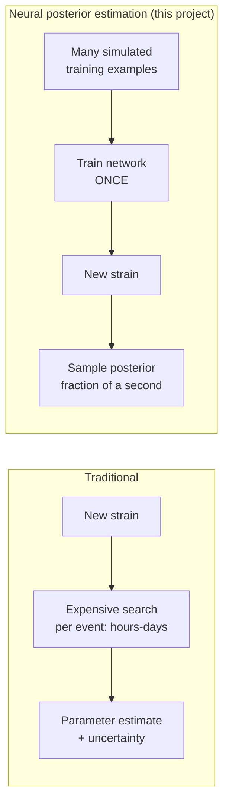

# Background: the science, for zero-context readers

This file builds intuition with plain language and analogies. No equations
here — for the actual math, see [`TUTORIAL.md`](TUTORIAL.md).

## What LIGO strain data physically is

LIGO (the Laser Interferometer Gravitational-Wave Observatory) is, at its
core, an extremely sensitive ruler. It has two 4-kilometer arms at a right
angle, with a laser beam bouncing down each one. A gravitational wave
passing through stretches one arm and squeezes the other by a tiny amount
— at its strongest, roughly **one part in 10²¹**. To put that in
perspective: if one arm were the distance from the Earth to the nearest
star, that stretch would be about the width of a human hair.

**"Strain"** is just the name for that fractional length change over time,
recorded as a single number thousands of times per second (this project
uses 4096 samples/second). So the raw data this whole pipeline starts from
is nothing more exotic than: *one number per instant, telling you how much
the detector's arms wobbled relative to each other.*

The problem: that wobble is almost entirely **noise** — seismic ground
motion, thermal jitter in the mirrors, laser quantum noise, passing trucks,
even distant ocean waves. A real gravitational-wave signal is buried deep
inside it, and most of the work in this pipeline (whitening, bandpassing,
matched filtering — see `TUTORIAL.md`) exists to separate the two.

## What a binary-black-hole merger looks like in the data

This project focuses on **binary black hole (BBH) mergers**: two black
holes spiraling into each other and colliding. As they spiral closer, three
things happen together, very fast, in the last fraction of a second:

- they orbit **faster** (higher frequency),
- they emit **more** gravitational-wave power (higher amplitude),
- and then, at the moment of collision ("merger"), the signal peaks and
  rings down as the resulting single black hole settles into its final
  shape.

This rising-frequency, rising-amplitude pattern is called a **chirp** — the
same word used for a bird call that rises in pitch, because on a
time-frequency plot it looks and (if played as audio) even sounds like one:

```
frequency
   ^
   |                                    ___
   |                                ___/   \  ← ringdown
   |                          ___--          (brief, settles fast)
   |                    __---
   |              __---
   |        __---
   |   __---
   |--
   +------------------------------------------> time
        (inspiral: slow rise)      (merger)
```

A real chirp from a stellar-mass BBH merger lasts anywhere from a fraction
of a second to tens of seconds in LIGO's sensitive band, depending on the
masses involved — heavier black holes merge faster and at lower frequency;
lighter ones spend longer sweeping through higher frequencies. Section 1 of
`main.ipynb` plots exactly this kind of time-frequency ("spectrogram") view
for two real, confirmed events, as a sanity check that the pipeline's
signal-processing recovers something that actually looks like a chirp.

## What "parameter estimation" means

Once you're confident a chirp is really there, the next question is: *what
produced it?* A BBH merger is fully described (for our purposes) by a
handful of physical numbers — how massive each black hole was, how fast
each was spinning, how far away the system is, and so on. **Parameter
estimation (PE)** is the task of working backward from the observed strain
data to a best guess (and, crucially, an honest *uncertainty*) for those
numbers.

This project targets four parameters: **chirp mass**, **mass ratio**,
**effective spin**, and **distance** (see `TUTORIAL.md` for exactly how
these are defined and why these four rather than raw masses/spins). Sky
location, orbital inclination, and polarization angle are deliberately
excluded — recovering those requires comparing arrival times and signal
shapes across *multiple* detectors at different locations on Earth
(triangulation, much like how you can tell where a sound came from with two
ears but not with one), and this project uses only a single detector (H1).

## What a normalizing flow / neural posterior estimator does

The traditional approach to PE (used in real LIGO analyses) is
computationally expensive: for every single event, run a search algorithm
that tries millions of candidate parameter combinations, sees how well each
one's predicted waveform matches the data, and builds up a picture of which
parameters are plausible. This can take hours to days *per event*, because
that expensive search process is redone from scratch every time.

**Neural posterior estimation (NPE)** flips this around. Instead of
re-solving the same kind of problem from scratch every time, you *train* a
neural network once, in advance, on many simulated examples ("if the true
parameters were X, here's roughly what the noisy strain would look like").
Once trained, the network can look at a *new* piece of strain data it's
never seen and, in a fraction of a second, output not just a single guess
but a full **posterior distribution** — a complete probabilistic picture of
which parameter combinations are plausible and which aren't, with the right
relative weight given to each. This is the "amortized inference" idea:
front-load the expensive part (training) once, and get cheap, honest
uncertainty estimates on every new example afterward.

The specific architecture used here, a **normalizing flow**, is a neural
network built specifically to represent complex probability distributions
(not just single numbers) — it can output a full multi-dimensional
"cloud of plausible parameter values" for each event, rather than a single
best-fit point.



## What "calibration" means, and why SBC measures it

A posterior estimator can be *wrong* in two very different ways. It can be
wrong about the **point estimate** (its best guess for, say, the chirp mass
is off). Or — more subtly, and more dangerous if unnoticed — it can be
**miscalibrated**: it might report tight, confident uncertainty ranges that
are actually wrong far more often than the model claims.

Here's the weather-forecaster analogy that makes this concrete: a
well-calibrated forecaster who says "70% chance of rain" should, if you
track many such days, actually see rain on close to 70% of them. A
forecaster who says "70% chance of rain" but it only rains 30% of the time
is *overconfident* — badly calibrated, even if their rain/no-rain call is
often technically "close." The same idea applies to a posterior estimator:
if it reports a range that's supposed to contain the true parameter value
90% of the time, does it actually?

**Simulation-Based Calibration (SBC)** is the tool this project uses to
check exactly that, and it can do so *without knowing the true answer for
any real event* — it works entirely on simulated data, where the true
parameters are known by construction:

1. Generate a held-out simulated example with known true parameters.
2. Ask the trained model for its posterior (its cloud of plausible
   parameter values) given that example's data.
3. Check where the *true* value falls within that cloud — is it dead
   center? Near the edge? Outside entirely?
4. Repeat over many held-out examples, and look at the *distribution* of
   where the true value landed each time.

If the model is well-calibrated, the true value should land in a
statistically uniform, unbiased place across the held-out set — sometimes
near the middle of the posterior, sometimes near an edge, in the
proportions you'd expect by chance. If the model is systematically
overconfident, the true value will land near the edges (or outside the
bulk of the posterior) far more often than chance would predict. This
project uses a Kolmogorov-Smirnov (KS) test to check that quantitatively —
see `TUTORIAL.md` for exactly how.

## Why O3a vs. O4a is the specific comparison being tested

LIGO doesn't observe continuously — it runs in **observing runs** (O1, O2,
O3a, O3b, O4a, ...), with maintenance and hardware-upgrade periods in
between. Each upgrade changes the detector's **noise characteristics**: how
loud it is at different frequencies, what its dominant noise sources are,
and so on.

This matters directly for this project's research question. A model
trained on simulated signals injected into O3a noise has, in effect,
learned what "typical noise" looks like *for O3a specifically* — as part of
learning to separate signal from noise, it has implicitly learned
something about O3a's noise properties. The concrete upgrade between O3a
and O4a that motivates this specific comparison: LIGO increased its
circulating laser power and switched from frequency-independent to
frequency-dependent **squeezed-light injection** — a quantum-optics
technique that reduces detector noise, but by different amounts at
different frequencies than before. That's a real, documented change to the
detector's noise *shape*, not just its overall loudness — exactly the kind
of shift that could plausibly fool a model that implicitly learned "what
O3a noise looks like" during training.

```
noise
loudness
(ASD)
   ^
   |  \\                              O3a (training)
   |   \\___                           O4a (never trained on)
   |       \\___        __--\\
   |           \\__ __--      \\___
   |               V               \\___
   +-------------------------------------> frequency
        low freq         "sweet spot"      high freq
                    (bandpass: 35-350 Hz)
```

The question this project asks: **does the model's calibration hold up
when the noise it's evaluated against has shifted like this, even though it
was never trained on data from the new regime?** That's what Section 2
(comparing the two runs' actual noise curves), Section 7 (the SBC
comparison), and the PSD-drift check in between are all built around. See
`PROPOSAL.md` for why O3a→O4a specifically was chosen over other run pairs,
and `main.ipynb` Section 7 for the actual answer this project found.
