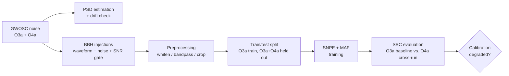

# LIGO NF-PE Calibration Pipeline

DSC 207 (UC Berkeley) course project. **Does a neural posterior estimator
trained to infer gravitational-wave source parameters from LIGO noise
silently lose calibration when the detector's noise changes?**

We train a normalizing-flow posterior estimator (`sbi` SNPE + MAF) on
simulated binary-black-hole signals injected into real LIGO H1 noise from
the O3a observing run, then test whether its calibration holds up when
evaluated on O4a noise — a real, documented hardware/sensitivity upgrade
the model never saw during training. Calibration is assessed with
Simulation-Based Calibration (SBC), the standard tool for checking whether
a posterior estimator's uncertainty is trustworthy, not just its point
estimates.

New here? Read in this order:

1. **This file** — what the project is, how to run it.
2. [`BACKGROUND.md`](BACKGROUND.md) — plain-language science background, zero prior knowledge assumed.
3. [`TUTORIAL.md`](TUTORIAL.md) — the math/signal-processing behind each pipeline stage, alongside how to run it.
4. [`PROPOSAL.md`](PROPOSAL.md) — the project proposal: research question, methods, findings, scope.
5. [`notebooks/main.ipynb`](notebooks/main.ipynb) — the actual deliverable: code, plots, results, and findings, narrated top to bottom.

## Pipeline at a glance



Every expensive stage (noise acquisition, injection generation, training,
SBC) is checkpointed under `artifacts/` with a metadata sidecar — rerunning
the notebook reuses whatever is still valid for the current `config.py` and
regenerates whatever isn't.

## Project layout

```
DSC207/
├── README.md              this file
├── BACKGROUND.md           plain-language science background
├── TUTORIAL.md             math/signal-processing + how to run each stage
├── PROPOSAL.md             project proposal (research question, methods, findings)
├── requirements.txt
├── config.py               every tunable parameter, single source of truth
├── ligo_pipeline/          reused helpers only (imported by the notebook)
│   ├── noise.py               GWOSC fetching + quality checks
│   ├── injections.py          waveform generation + injection
│   ├── preprocessing.py       whitening, bandpass, crop, derived params
│   ├── evaluation.py          SBC, KS-tests, subsample + drift comparisons
│   └── utils.py                atomic writes, checkpointing, validation, logging
├── notebooks/
│   └── main.ipynb           THE deliverable — all narrative, plots, findings
├── artifacts/               generated checkpoints (gitignored)
└── tests/                   unit tests for the trickier ligo_pipeline/ logic
```

`ligo_pipeline/` holds only code that's genuinely called from more than one
place (noise QC used for both O3a and O4a, injection generation called
hundreds of times, etc.). The actual pipeline calls, loops, plots, and the
markdown explaining what each result means all live directly in
`notebooks/main.ipynb` — open that notebook and read it top to bottom to
see the whole story.

## Quick start

```bash
cd DSC207
python -m venv .venv && source .venv/bin/activate
pip install -r requirements.txt

pytest tests/                       # fast, no network/GPU needed
jupyter notebook notebooks/main.ipynb
```

Requirements: AWS credentials with read access to the project's S3 bucket
(Section 1 only — a real-strain sanity check), and outbound internet access
to GWOSC. See `TUTORIAL.md` for expected runtime per stage and what's safe
to interrupt/resume.

**Note on this deliverable's provenance:** this directory was restructured
from a single monolithic notebook (the module split, `config.py`, and this
documentation are new); the pipeline logic itself is unchanged. `main.ipynb`
was built and reviewed for correctness against that source but has not been
re-executed end-to-end in this environment — running it requires the full
GW/ML stack (`pycbc`, `sbi`, `torch`, `gwosc`, live S3/GWOSC access) which
isn't available here. See `TUTORIAL.md` for expected runtimes.
