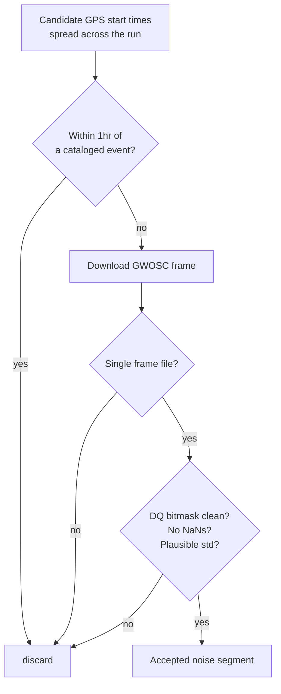

# Tutorial: the math behind every stage, and how to run it

Assumes general math/ML background (Fourier transforms, basic probability,
neural networks) but zero gravitational-wave-specific knowledge — that's
taught from scratch here. For plain-language intuition first, see
[`BACKGROUND.md`](BACKGROUND.md). Each section below maps directly onto a
section of [`notebooks/main.ipynb`](notebooks/main.ipynb) and the
`ligo_pipeline/` module that implements it.

---

## Stage 1: PSD estimation, whitening, bandpassing

**Where:** `ligo_pipeline/preprocessing.py` (`estimate_psd`, `whiten`,
`bandpass`) — used throughout, first exercised in `main.ipynb` Section 1.

### Welch's method (PSD estimation)

The **power spectral density (PSD)**, `S(f)`, describes how much power a
noise process has at each frequency. We estimate it with **Welch's
method**: split the time series into overlapping segments, window each
segment, take its FFT, square the magnitude, and average across segments:

```
S(f) ≈ (1 / K) * Σ_{k=1}^{K} |FFT(w · x_k)(f)|² / (fs · Σ w²)
```

where `x_k` is the k-th windowed segment, `w` the window function, and
`fs` the sample rate. Averaging over `K` segments trades time resolution
for reduced variance in the estimate — appropriate here since we only need
each run's *typical* noise level, not how it fluctuates second to second.
`estimate_psd` wraps `scipy.signal.welch` with `nperseg = sample_rate *
psd_nperseg_sec` (`config.CONFIG["psd_nperseg_sec"]` = 4 seconds).

### Whitening

Real detector noise is **colored** — much louder at some frequencies than
others (see the ASD plot in `BACKGROUND.md`). This makes both visual
inspection and matched filtering (Stage 3) harder: a loud noise band can
swamp a real signal even where the signal itself is much stronger relative
to *its own* local noise level.

**Whitening** rescales every frequency bin by its own noise amplitude, so
the result has (approximately) equal power at every frequency — turning
colored noise into white noise:

```
whitened = IFFT( FFT(strain) / sqrt(PSD) )
```

`whiten()` computes the strain's own PSD-independent FFT, linearly
interpolates the (coarser-resolution) PSD onto the strain's FFT frequency
bins, divides, and inverse-transforms back to the time domain.

### Bandpassing

Even after whitening, the detector is only *sensitive* — has a usable
signal-to-noise ratio — within a limited frequency band (here,
`bandpass_low_hz`–`bandpass_high_hz` = 35–350 Hz; see `BACKGROUND.md`'s ASD
sketch). A **Butterworth bandpass filter** (order `bandpass_order` = 4,
applied via `scipy.signal.filtfilt` for zero phase distortion — critical
here since we care about exact merger timing) removes everything outside
that band, improving the visual/statistical signal-to-noise ratio for
everything downstream.

**Run it:** these are pure-function, in-memory operations — no
checkpointing needed; they run in milliseconds per call and are called
per-segment/per-injection throughout the pipeline.

---

## Stage 2: Noise acquisition and quality vetting

**Where:** `ligo_pipeline/noise.py` — `main.ipynb` Section 2.

For each run, candidate start times are spread evenly across the run's GPS
time span, and any candidate within `event_exclusion_buffer_sec` (1 hour)
of a cataloged event is discarded — we want *noise*, not noise-plus-signal.
Each surviving candidate is then downloaded and vetted:

- **DQ (data-quality) bitmask check:** GWOSC frame files include a
  per-second quality bitmask; we require the "CBC CAT1–4"-equivalent clean
  bits (`dq_cbc_bits`) to all be set, i.e. no known instrumental
  glitches/vetoes in this second.
- **Broadband std check:** `noise_std_range` — segments with an implausibly
  low or high time-domain standard deviation are rejected as likely
  data-integrity issues rather than analyzed as-is.
- **NaN check** and **single-frame-file check** (a candidate spanning two
  separate frame files is skipped rather than stitched, for simplicity).



**Run it:** network-bound — each candidate is a multi-hundred-MB GWOSC
frame download, and `n_noise_segments_per_run` × 15 candidates may be
attempted before enough pass vetting (typical wall time: 10–30 minutes per
run on a normal connection, first run only). **Checkpointed and resumable**
— `o3a_noise_segments.pkl` / `o4a_noise_segments.pkl`; a compatible existing
checkpoint skips acquisition (including the GWOSC catalog query) entirely.

---

## Stage 2b: Lightweight PSD-drift monitoring check

**Where:** `ligo_pipeline/evaluation.py` (`detect_psd_drift`) — `main.ipynb`
Section 2, right after the O3a-vs-O4a ASD plot.

This reuses `average_psd`'s output (no new data, no training) to ask: would
a cheap comparison of the two runs' noise curves alone have flagged
"something changed enough here to warrant a recalibration check" — computed
*before* the expensive SBC evaluation in Stage 7 ever runs?

Two independent, complementary criteria, both restricted to the in-band
frequencies (`bandpass_low_hz`–`bandpass_high_hz`) actually used by the
model:

**1. Two-sample KS-test.** The one-sample KS-test in Stage 7 compares an
empirical distribution against a known reference (Uniform(0,1)). Here we
instead use the **two-sample** variant (`scipy.stats.ks_2samp`), which
compares two *empirical* distributions against each other — in this case,
the set of in-band ASD values for O3a vs. O4a, treated as unpaired samples.
It computes the largest gap between their empirical CDFs:

```
D = sup_x |F_a(x) − F_b(x)|
```

A small p-value means the two curves' *shapes* differ by more than sampling
variation alone would explain.

**2. Median relative ASD difference.** A simpler, more interpretable
magnitude: interpolate O4a's ASD onto O3a's frequency grid and compute

```
relative_diff(f) = |ASD_b(f) − ASD_a(f)| / ASD_a(f)
```

then take the median across the band. This directly answers "how many
percent louder/quieter is the new run's noise floor, typically."

Either criterion above its threshold (`psd_drift_ks_alpha` = 0.05,
`psd_drift_relative_threshold` = 20%, both in `config.py`) flags
"retrain-warranted." **These thresholds are illustrative defaults for a
monitoring-signal demonstration, not values tuned or validated against
known-good/known-drifted cases** — see `PROPOSAL.md` for that caveat and
what the actual flag means (or doesn't) for this project's finding.

**Run it:** pure NumPy/SciPy on two already-computed PSD arrays —
milliseconds, no checkpointing needed.

---

## Stage 3: Simulated signal injection

**Where:** `ligo_pipeline/injections.py` — `main.ipynb` Sections 3–4.

### Parameter draw

Component masses and aligned-spin magnitudes are drawn uniformly from
`mass_prior_msun` / `spin_prior`; the higher draw is relabeled `mass_1` so
`mass_1 ≥ mass_2` by convention. Distance is drawn **uniform in comoving
volume**, not uniform in distance — since astrophysical sources are
(roughly) uniformly spread through space, and volume grows as `distance³`:

```
u ~ Uniform(0, 1)
distance = ( u · (d_hi³ − d_lo³) + d_lo³ )^(1/3)
```

This weights the draw toward larger distances, matching what a real,
volume-limited detector survey would actually see, rather than uniform
in distance (which would over-represent nearby sources).

### Waveform generation and matched-filter SNR

A time-domain waveform is generated with the `IMRPhenomD` approximant
(aligned-spin, no precession — consistent with the spin prior and target
parameters, which likewise exclude precession angles). Its **optimal
matched-filter SNR** against the target noise segment's own PSD is:

```
SNR² = 4 · Re ∫ |h̃(f)|² / S_n(f) df     (from f_lower to Nyquist)
```

computed via `pycbc.filter.sigma`. This is the same statistic real
detection pipelines threshold on; injections below `snr_threshold` = 8 are
rejected and redrawn — an expected, routine part of rejection sampling, not
an error (see `ligo_pipeline.injections.generate_injection`'s docstring).

### Peak-alignment and buffer sizing

The waveform must be placed into the noise segment so its **merger** lands
at a requested time offset. The naive approach — aligning the waveform's
*last* sample to the merger time — silently biases the merger time earlier
by however far the post-merger ringdown extends past the true peak.
Instead, `_compute_injection_window` (factored out for unit testing —
see `tests/test_injections.py`) aligns the waveform's **peak** sample:

```
                    ◄──────── buf_samples ────────►◄──────── buf_samples ────────►
   noise segment:  [ ...................... | ...................... ... ]
                                          buf_start                    buf_end
                              waveform: [ pre-merger inspiral | peak | ringdown ]
                                                                 ▲
                                                          merger_idx (requested)
```

`half_width = max(peak_idx, waveform_len − peak_idx) + safety_margin`
ensures the buffer is wide enough on *whichever side is longer* (usually
the pre-merger inspiral, which can be much longer than the brief
post-merger ringdown) to hold the entire waveform, then `buf_samples =
max(configured buffer_sec, half_width)`, and the buffer is finally clipped
to the noise segment's own bounds. See `tests/test_injections.py` for the
edge cases this covers (asymmetric waveforms, near-boundary mergers).

**Run it:** `generate_injection_dataset` loops until `n_injections_per_run`
= 800 are accepted per run; waveform generation + SNR computation is
millisecond-scale per attempt, so wall time is dominated by the SNR
rejection rate (typically minutes, not hours, per run). Progress logs every
100 accepted injections. **Checkpointed** — `o3a_injections.pkl` /
`o4a_injections.pkl`.

---

## Stage 4: Derived parameters and preprocessing

**Where:** `ligo_pipeline/preprocessing.py`
(`compute_derived_params`, `preprocess_injection`) — `main.ipynb` Section 5.

Raw component masses/spins aren't the most natural inference targets — a
gravitational waveform's *leading-order* shape depends much more strongly
on certain *combinations* of mass and spin than on the raw values
individually. Three standard combinations:

**Chirp mass** — the single combination that dominates a waveform's
frequency evolution (the "chirp rate" in `BACKGROUND.md`'s sketch):

```
M_c = (m₁ m₂)^(3/5) / (m₁ + m₂)^(1/5)
```

**Mass ratio** — `q = m₂ / m₁` (with `m₁ ≥ m₂` enforced at the draw, so
`q ∈ (0, 1]`).

**Effective spin** — the mass-weighted, aligned-spin combination that
enters the waveform phase at leading order:

```
χ_eff = (m₁ χ₁ + m₂ χ₂) / (m₁ + m₂)
```

Each injection is then whitened using its **own noise segment's** PSD (not
the injected/signal-containing array — matching real practice, where the
PSD is estimated from off-source background data the pipeline treats as
"clean"), bandpassed, and cropped to a fixed `crop_window_sec` = 2 s window
centered on merger — the model only ever sees this fixed-size window, never
the full noise segment.

**Run it:** O3a is split into `n_train = 750` training examples and
`n_holdout_o3a = 50` held out for the O3a SBC baseline; all 800 O4a
injections are reserved for cross-run testing only and never touch
training. A leakage check confirms the two O3a index sets are disjoint.
Fast (seconds) once injections exist. **Checkpointed** —
`training_data.pkl`.

---

## Stage 5: SNPE + MAF training

**Where:** `main.ipynb` Section 6, using `sbi.inference.SNPE`.

**Sequential Neural Posterior Estimation (SNPE)** trains a **Masked
Autoregressive Flow (MAF)** — a normalizing flow that models a complex
posterior `p(θ | x)` as a sequence of invertible, autoregressive
transformations applied to a simple base distribution (e.g. a standard
Gaussian). Concretely, an autoregressive flow factors the joint density
over the 4 target parameters as a product of conditionals, each modeled
by a neural network:

```
p(θ | x) = Π_i p(θ_i | θ_{<i}, x)
```

with each conditional an invertible transform of a base-distribution
sample, whose parameters are themselves output by a neural network
conditioned on `x` (the strain) and the previous `θ` components. Training
maximizes the log-likelihood of the *true* simulated `(θ, x)` pairs under
this flow — equivalently, minimizes the KL divergence between the flow and
the true posterior, in the many-simulations limit. This project uses a
single simulation round (the "SNPE" default single-round setting, as
opposed to further amortization-refining rounds), which is standard for a
fixed simulation budget like this one.

**A known environment quirk, not a modeling choice:** in the `ligo-poc`
environment this notebook targets, torch 2.2.x's `.numpy()` conversion is
broken against NumPy ≥2.0 (`RuntimeError: Numpy is not available`) —
`requirements.txt` pins `numpy<2.0` for exactly this reason, and anywhere
the code needs a plain NumPy/Python view of a tensor it uses `.tolist()`
instead of `.numpy()`.

**Run it:** on CPU, training on ~750 examples with `sbi`'s default
architecture and early stopping typically takes a few minutes (no GPU
required for a dataset this size). A one-example posterior-sampling
smoke test runs immediately after training as a fast sanity check before
the full SBC evaluation. **Checkpointed** — `trained_posterior.pkl`.

---

## Stage 6: Simulation-Based Calibration (SBC)

**Where:** `ligo_pipeline/evaluation.py` — `main.ipynb` Section 7.

### The rank statistic

For each held-out example `i` with known true parameter value `θ_i`, draw
`N` samples from the trained posterior `p(θ | x_i)` and count how many fall
below the true value:

```
rank_i = #{ j : sample_j < θ_i }        (out of N samples, per parameter)
```

If the posterior is well-calibrated, `θ_i` is, from the model's own
perspective, just another draw from its posterior — so its rank among `N`
posterior samples should be **uniformly distributed** over `{0, 1, ..., N}`
across many held-out examples. This is the mathematical content of the
weather-forecaster intuition in `BACKGROUND.md`: a "90% credible interval"
should contain the truth 90% of the time, which is exactly the statement
that ranks are uniform.

### The KS-test against uniform

Normalize each rank to `rank_i / N ∈ [0, 1]`, pool across the held-out set,
and run a one-sample **Kolmogorov-Smirnov test** against `Uniform(0, 1)`:

```
D = sup_x | F_empirical(x) − F_Uniform(x) |
```

`summarize_sbc_ks` reports both the KS statistic `D` (0 = perfect match)
and its p-value (probability of seeing a gap this large, or larger, if the
model really is well-calibrated) for each of the 4 target parameters.

### Why bounded retries, not `sbi.diagnostics.run_sbc` directly

Posterior sampling here uses **rejection sampling** internally (`sbi`'s
default for this posterior type). For a small number of examples, the
acceptance rate can collapse toward zero, hanging indefinitely inside
`sbi`'s batched `run_sbc`. `run_sbc_with_retries` bounds this per example:
`sbc_max_retries` attempts (retries can succeed, since rejection sampling
is stochastic) of up to `sbc_max_sampling_time_sec` = 10s each; an example
that still fails is recorded in `failed_indices` and excluded from the KS
statistics — **never silently zero-filled**. See Section 8 of
`main.ipynb` and `PROPOSAL.md` for the (partially unresolved)
investigation into *why* a handful of examples fail this way.

### Repeated-subsample comparison

O3a's held-out set (`n_holdout_o3a` = 50) is far smaller than O4a's full
test set (800, minus any `failed_indices`). A single KS statistic computed
on all of O4a isn't directly comparable to one computed on 50 O3a examples
— larger samples produce systematically smaller/tighter KS statistics
under the null. `repeated_subsample_ks` instead draws `sbc_subsample_repeats`
= 10 independent subsamples of O4a, each matched to O3a's held-out size,
and reports the resulting *range* of KS statistics — an apples-to-apples
comparison: if O3a's single value falls inside that range, the two runs
aren't distinguishable from each other at this sample size.

**Run it:** O3a SBC (`n=50` × up to 1000 posterior samples × up to 2
retries) and O4a SBC (`n=800` × up to 200 posterior samples × up to 2
retries) are both bounded by the retry/timeout policy above — worst case is
bounded, but typical wall time is much faster since most examples succeed
on the first attempt. **Checkpointed independently** — `sbc_o3a.pkl` /
`sbc_o4a.pkl` — so a failure or interruption in one doesn't require
re-running the other.

---

## Practical notes: checkpointing and resuming

Every stage above follows the same pattern (`ligo_pipeline/utils.py`):
`load_checkpoint(path, expected_meta, validator)` is tried first; if the
checkpoint is missing, corrupt, or was produced by a **different**
`config.py` (compared field-by-field against `expected_meta`), the stage
re-runs and calls `save_checkpoint` at the end. This means:

- **Interrupting and re-running the notebook is always safe** — completed
  stages are skipped, not redone.
- **Changing a parameter in `config.py` automatically invalidates only the
  stages that actually depend on it** — a changed `snr_threshold`
  invalidates injection generation onward, but not a completed noise
  acquisition.
- Every checkpoint's `.meta.json` sidecar records exactly what configuration
  produced it, alongside `config.get_software_versions()` — useful for
  diagnosing "why didn't my checkpoint get reused" or "was this result
  reproduced under the same library versions."
