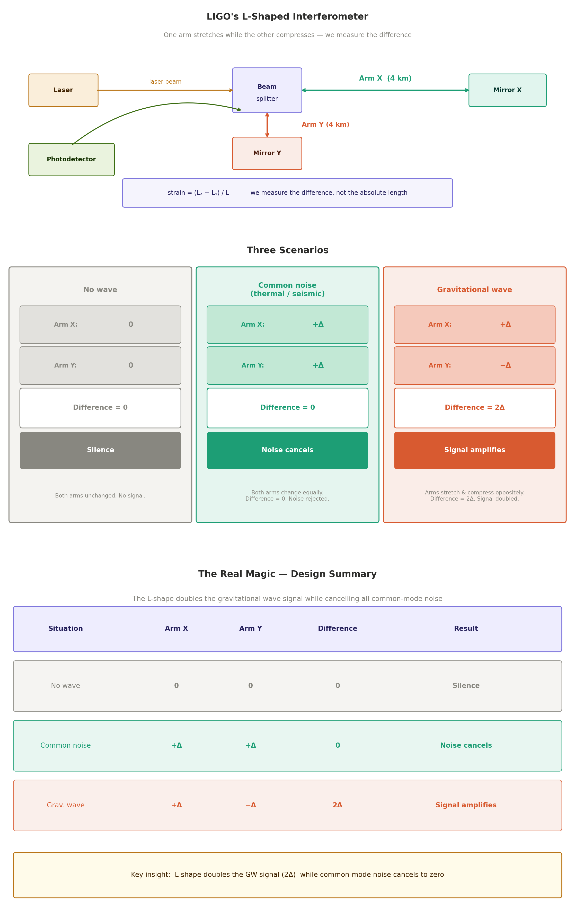

# Gravitational Wave ML Pipeline

A signal processing and machine learning pipeline for LIGO gravitational wave data — from raw strain to analysis-ready features.

---

## Table of Contents

- [Background](#background)
- [LIGO Detectors](#ligo-detectors)
- [Data Source](#data-source)
- [Project Structure](#project-structure)
- [Pipeline Architecture](#pipeline-architecture)
- [Signal Processing Techniques](#signal-processing-techniques)
- [Setup](#setup)

---

## Background

Gravitational waves are ripples in spacetime caused by accelerating massive objects — predicted by Einstein in 1916 and first directly detected in 2015. The biggest sources are merging black holes, neutron stars, and supernovae.

| Year | Event |
|------|-------|
| 1916 | Gravitational waves predicted — Einstein |
| 1970s–80s | Concept developed — Rainer Weiss & others |
| 1990s | Construction begins — funded by NSF |
| 2015 | First detection — **GW150914** |
| 2017 | Nobel Prize awarded |

---

## LIGO Detectors

**LIGO (Laser Interferometer Gravitational-Wave Observatory)** uses laser interferometry to measure spacetime distortions smaller than 1/1,000th the diameter of a proton.

### Global Network

| Detector | Location | Operator |
|----------|----------|----------|
| LIGO H1 | Hanford, Washington | Caltech / MIT |
| LIGO L1 | Livingston, Louisiana | Caltech / MIT |
| Virgo | Cascina, Italy | EGO (European) |
| KAGRA | Kamioka, Japan | ICRR Japan |

Multiple detectors are essential for confirming real signals and triangulating sky position.

### How the Arms Work

Each LIGO site has two perpendicular 4 km arms. A gravitational wave stretches one arm while compressing the other — the detector measures the **difference**:



$$\text{strain} = \frac{L_x - L_y}{L}$$

| Situation | Arms | Difference | Result |
|-----------|------|------------|--------|
| No wave | both `0` | `0` | silence |
| Common noise | both `+Δ` | `0` | **noise cancels** |
| Gravitational wave | `+Δ` and `−Δ` | `2Δ` | **signal amplifies** |

This differential design doubles the gravitational wave signal while rejecting common-mode noise like thermal vibration.

---

## Data Source

Data comes from **GWOSC (Gravitational Wave Open Science Center)** — the public portal for LIGO/Virgo/KAGRA strain data.

### Available Science Runs

| Run | Dates | GPS Start | GPS End |
|-----|-------|-----------|---------|
| O1 | Sep 2015 – Jan 2016 | 1126051217 | 1137254417 |
| O2 | Nov 2016 – Aug 2017 | 1164556817 | 1187733618 |
| O3a | Apr 2019 – Oct 2019 | 1238166018 | 1253977218 |
| O3b | Nov 2019 – Mar 2020 | 1256655618 | 1269363618 |
| O4 | May 2023 – ongoing | 1368720018 | ongoing |

Data is only available during active science runs. Gaps between runs are offline periods for detector upgrades.

### Sample Rates

| Rate | Nyquist | Use |
|------|---------|-----|
| 4,096 Hz | 2,048 Hz | Standard — sufficient for most GW analysis (signals are 10–2,000 Hz) |
| 16,384 Hz | 8,192 Hz | Full resolution — larger files, higher-frequency detail |

### File Format

Strain data is stored as **HDF5** — a hierarchical container with the signal, metadata, and quality flags bundled together:

```
H-H1_GWOSC_4KHZ_R1-<GPS_START>-<DURATION>.hdf5
│
├── /strain/strain     ← 1D strain time series
├── /meta/             ← detector, sample rate, GPS start
└── /quality/          ← data quality flags
```

---

## Project Structure

```
gravitational-wave-ml-pipeline/
│
├── data/
│   ├── raw/           ← original HDF5 files from GWOSC
│   ├── bronze/        ← ingested, minimally transformed
│   ├── silver/        ← cleaned and processed
│   └── gold/          ← analysis-ready features
│
├── src/python/
│   ├── main.py
│   ├── utils/
│   │   ├── data_loader.py
│   │   ├── preprocessing.py
│   │   └── processing.py
│   ├── feature_eng/
│   └── EDA/
│
├── notebooks/         ← exploratory and analysis notebooks
├── tutorials/         ← signal processing reference notes
├── documents/
├── outputs/
└── requirements.txt
```

---

## Pipeline Architecture

Data flows through a **medallion (bronze → silver → gold)** architecture:

| Layer | Contents | Transformations |
|-------|----------|-----------------|
| **Raw** | Original HDF5 files | None — immutable source |
| **Bronze** | Loaded strain arrays | Ingestion, GPS alignment |
| **Silver** | Cleaned signals | Bandpass filter, whitening, quality checks |
| **Gold** | Feature arrays | Spectrograms, Welch PSD, normalization |

---

## Signal Processing Techniques

| Technique | Purpose |
|-----------|---------|
| **Bandpass filter** | Remove low-frequency seismic noise and high-frequency shot noise; keep the 10–2,000 Hz GW band |
| **Whitening** | Flatten the noise power spectrum so all frequencies are equally weighted |
| **Fourier transform** | Decompose strain into frequency components |
| **Spectrogram** | Time-frequency representation for visual and ML feature extraction |
| **Welch PSD** | Robust power spectral density estimate via averaged periodograms |
| **Z-score normalization** | Standardize strain amplitude to flag statistically anomalous values |

---

## Setup

```bash
git clone <repo-url>
cd gravitational-wave-ml-pipeline
pip install -r requirements.txt
```

Download strain data from [gwosc.org](https://gwosc.org) and place HDF5 files in `data/raw/`.

---
