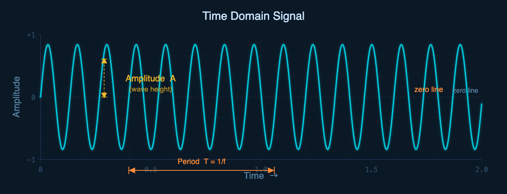
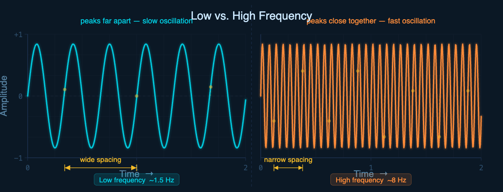
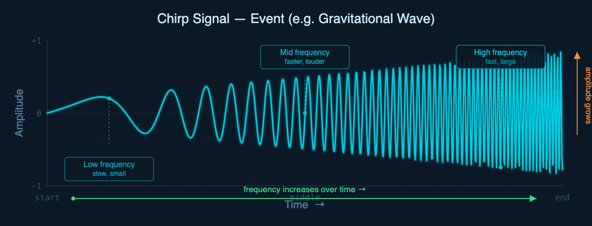
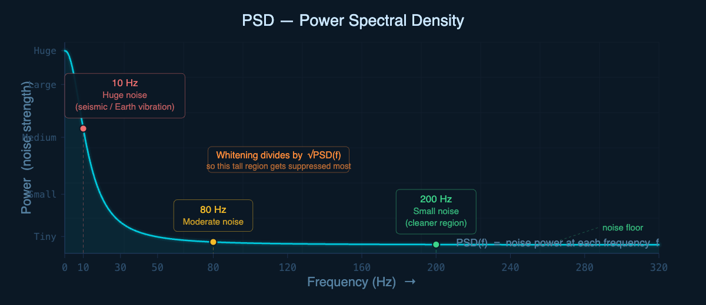

# 🌊 Signal Processing & LIGO — Complete Foundation Notes

> **A structured guide to understanding signals, Fourier transforms, and gravitational wave detection intuition.**

---

## 📑 Table of Contents

- [What is a Signal?](#1-what-is-a-signal)
- [Time Domain](#2-time-domain)
- [Amplitude](#3-amplitude)
- [Frequency](#4-frequency)
- [Low vs High Frequency](#5-low-vs-high-frequency)
- [Amplitude vs Frequency](#6-amplitude-vs-frequency)
- [Noise vs Event](#7-noise-vs-event)
- [Standard Deviation & Variance](#8-standard-deviation--variance)
- [Why High STD Windows Matter](#9-why-high-std-windows-matter)
- [Fourier Transform Intuition](#10-fourier-transform-intuition)
- [Fourier Transform Formula](#11-fourier-transform-formula)
- [Core Fourier Intuition](#12-core-fourier-intuition)
- [Fourier Coefficient](#13-fourier-coefficient)
- [Magnitude](#14-magnitude)
- [Frequency Domain](#15-frequency-domain)
- [FFT vs Fourier Transform](#16-fft-vs-fourier-transform)
- [PSD — Power Spectral Density](#17-psd-power-spectral-density)
- [Strength vs Power](#18-strength-vs-power)
- [Real Event vs Noise in Frequency Domain](#19-real-event-vs-noise-in-frequency-domain)
- [Spectrogram / STFT](#20-spectrogram--stft)
- [Spectrogram Intuition](#21-spectrogram-intuition)
- [Spectrogram Patterns](#22-spectrogram-patterns)
- [Bandpass Filtering](#23-bandpass-filtering)
- [Why Signals Disappeared After Filtering](#24-why-signals-disappeared-after-filtering)
- [Filtering Intuition](#25-important-filtering-intuition)
- [Hidden Frequencies](#26-hidden-frequencies)
- [Manual Fourier Example](#27-manual-fourier-example)
- [Sampling Rate & Frequency Bins](#28-sampling-rate--frequency-bins)
- [Nyquist Frequency](#29-nyquist-frequency)
- [Overall DSP Pipeline](#30-overall-dsp-pipeline)
- [Core Intuitions Summary](#31-most-important-core-intuitions)
- [Whitening](#32-whitening)

---

## 1. What is a Signal?

> A **signal** is simply: a sequence of values changing over time.

In the context of **LIGO (Laser Interferometer Gravitational-Wave Observatory)**:

- The signal is called **strain**
- It measures tiny **spacetime distortions**

```python
x = [0.01, 0.02, -0.01, 0.03, ...]
# Each value = strain at a tiny moment in time
```

---

## 2. Time Domain

In the **time domain**, we plot signal amplitude over time:

| Axis | Meaning |
|------|---------|
| x-axis | Time |
| y-axis | Strain / Amplitude |

<p align="center">

</p>

**Time domain answers:**
- ⏱️ *When* did something happen?
- 📏 *How large* was the signal?
- 📈 *How does* the signal evolve visually?

---

## 3. Amplitude

> **Amplitude** = how tall the signal oscillation is.

| Amplitude | Meaning |
|-----------|---------|
| 🔺 Large | Stronger oscillation, larger fluctuations |
| 🔻 Small | Weaker oscillation |

> ⚠️ **Important:** Amplitude is **NOT** frequency — they are independent properties!

---

## 4. Frequency

> **Frequency** = how many cycles happen per second.

**Unit:** Hertz (Hz)

| Frequency | Meaning |
|-----------|---------|
| 1 Hz | 1 cycle per second |
| 10 Hz | 10 cycles per second |
| 100 Hz | 100 cycles per second |

---

## 5. Low vs High Frequency

<p align="center">

</p>

> **Frequency is determined by the horizontal spacing between peaks — NOT peak height.**

---

## 6. Amplitude vs Frequency

These two properties are **completely independent**:

| Case | Meaning |
|------|---------|
| High amplitude + Low frequency | Big, slow wave |
| Small amplitude + High frequency | Tiny, fast wave |

| Property | Determined by |
|----------|--------------|
| **Frequency** | Oscillation speed |
| **Amplitude** | Wave height |

---

## 7. Noise vs Event

### 🔀 Noise
```
Random fluctuations: 0.001, -0.002, 0.0007, 0.001 ...
→ messy / jittery / no clear structure
```

### 🌊 Event (Chirp)

<p align="center">

</p>

---

## 8. Standard Deviation & Variance

> **STD / Variance** measures how strongly values fluctuate around the mean.

| STD | Meaning |
|-----|---------|
| 🔻 Small | Small fluctuations |
| 🔺 Large | Strong fluctuations |

**STD tells you:**
- ✅ Fluctuation strength / amplitude spread

**STD does NOT tell you:**
- ❌ Frequency
- ❌ Oscillation speed

---

## 9. Why High STD Windows Matter

If a signal window **suddenly** has a large STD:

```
Normal:   small fluctuations  → low STD
Anomaly:  large oscillations  → high STD
```

> 🔍 Something unusual may be present — could be an **event**, a **glitch**, or a **noise burst**.

> ⚠️ **High STD ≠ guaranteed event** — it's a hint, not a conclusion.

---

## 10. Fourier Transform Intuition

> **Fourier asks:** *"Which frequencies exist inside this signal?"*

A real-world signal is usually a mixture:

```
signal = slow wave
       + fast wave
       + noise
       + other oscillations
```

All **added together** — Fourier helps us **decompose** them.

---

## 11. Fourier Transform Formula

The **Discrete Fourier Transform (DFT)**:

$$X[k] = \sum_{n=0}^{N-1} x[n] \cdot e^{-j2\pi kn/N}$$

| Symbol | Meaning |
|--------|---------|
| `x[n]` | Signal sample at index n |
| `N` | Total number of samples |
| `k` | Frequency bin being tested |
| `X[k]` | Fourier coefficient at frequency k |

---

## 12. Core Fourier Intuition

Fourier does this for **each frequency** (1 Hz, 2 Hz, 3 Hz, ...):

```
Step 1: signal × test sinusoid
Step 2: sum everything up
```

| Result | Meaning |
|--------|---------|
| Large sum | Signal strongly matches that frequency |
| Near-zero sum | Cancellation — frequency not present |

---

## 13. Fourier Coefficient

> `X[k]` answers: *"How much of frequency k exists in the signal?"*

| Coefficient | Meaning |
|-------------|---------|
| 🔺 Large | Strong frequency presence |
| 🔻 Small | Weak frequency presence |

---

## 14. Magnitude

Fourier coefficients are **complex numbers**:

$$X(f) = a + jb$$

**Magnitude** extracts the strength:

$$|X(f)| = \sqrt{a^2 + b^2}$$

> **Magnitude = frequency strength**

---

## 15. Frequency Domain

| Axis | Meaning |
|------|---------|
| x-axis | Frequency |
| y-axis | Frequency strength (magnitude) |

**Frequency domain answers:**
- ✅ Which oscillation speeds exist in the signal?

**Frequency domain does NOT answer:**
- ❌ When they happened

---

## 16. FFT vs Fourier Transform

| Method | What it is |
|--------|-----------|
| **Fourier Transform** | The mathematical operation |
| **FFT** | A fast algorithm that computes the same result |

> Same result. Different speed. FFT is used in practice because it's orders of magnitude faster.

---

## 17. PSD — Power Spectral Density

> **PSD** tells you: how much **power/noise** exists at each frequency.

$$\text{PSD}(f) \propto |X(f)|^2$$

Power uses **squared magnitude** — emphasizes dominant frequencies more strongly.

---

## 18. Strength vs Power

| Property | Meaning |
|----------|---------|
| Amplitude / Strength | Signal height |
| Power | Signal energy / intensity |

| Amplitude | Power |
|-----------|-------|
| 2 | 4 |
| 10 | 100 |

> ⚡ **Power grows quadratically with amplitude.**

---

## 19. Real Event vs Noise in Frequency Domain

| Pattern | Type | Cause |
|---------|------|-------|
| Single sharp peak | 🔴 Noise | Electrical, seismic, detector resonance |
| Broad frequency sweep | 🟢 Real chirp | Evolving gravitational wave event |

---

## 20. Spectrogram / STFT

> **Problem with FFT:** it loses all time information — only tells you what frequencies exist *overall*, not *when*.

**Solution: Short-Time Fourier Transform (STFT)**

---

## 21. Spectrogram Intuition

STFT works by sliding a window across the signal:

```
[window 1] → FFT → frequency snapshot at t₁
   [window 2] → FFT → frequency snapshot at t₂
      [window 3] → FFT → frequency snapshot at t₃
```

**Result — a 2D plot:**

| Axis | Meaning |
|------|---------|
| x-axis | Time |
| y-axis | Frequency |
| Color | Power (bright = strong) |

> Now we can track **how frequencies evolve over time**.

---

## 22. Spectrogram Patterns

| Pattern | Meaning | Example |
|---------|---------|---------|
| ➡️ Horizontal line | Constant-frequency noise | Electrical hum at 60 Hz |
| ↗️ Diagonal upward sweep | Chirp / gravitational wave | Binary merger event |
| 🔵 Localized blob | Transient burst / glitch | Instrumental artifact |

---

## 23. Bandpass Filtering

> **Bandpass filter** keeps only a selected frequency range — everything outside is removed.

**Example:**
```
Keep: 20 Hz → 300 Hz

Remove: everything below 20 Hz (seismic, drift)
Remove: everything above 300 Hz (high-frequency noise)
```

---

## 24. Why Signals Disappeared After Filtering

If your signal vanished after filtering, it means the signal was **dominated by low-frequency oscillations** (~7–10 Hz):

```
Original signal:  dominated by ~7-10 Hz oscillations
Filter applied:   keep only 20-300 Hz
Result:           low-frequency content removed → signal disappears
```

> ✅ The filter worked **correctly** — there was no energy in the passband.

---

## 25. ⚠️ Important Filtering Intuition

Filtering does **NOT** ask:

> ❌ "Is this an event or noise?"

Filtering **only** asks:

> ✅ "Is this frequency inside the allowed range?"

**It is frequency-selective, not content-aware.**

---

## 26. Hidden Frequencies

Original signal structure:
```
Large slow oscillation         ← visually dominates
+ small faster oscillation     ← hidden underneath
```

After filtering out the slow part:
```
Hidden faster oscillations become visible! ✨
```

### 🎵 Analogy:
> *Remove the loud bass → suddenly you can hear the flute.*

---

## 27. Manual Fourier Example

**Signal:**
```python
x = [1, 0, -1, 0]
```

**Testing k=1:**
```
X[1] = 2  →  Strong match! Large coefficient.
```

**Testing k=2:**
```
X[2] = 0  →  Cancellation! Frequency not present.
```

**PSD:**
```
|X[1]|² = 4
```

---

## 28. Sampling Rate & Frequency Bins

**Frequency mapping formula:**

$$f_k = \frac{k \cdot f_s}{N}$$

| Symbol | Meaning |
|--------|---------|
| `fₛ` | Sampling rate (Hz) |
| `N` | Number of samples |
| `k` | Frequency bin index |

**Example:**
```
fₛ = 4096 Hz,  N = 4096 samples
→ k = 20  corresponds to  20 Hz
```

---

## 29. Nyquist Frequency

> You can only meaningfully represent frequencies up to **half the sampling rate**.

$$f_{\text{max}} = \frac{f_s}{2}$$

**Example:**
```
fₛ = 4096 Hz
→ Meaningful range: 0 → 2048 Hz
```

> Above Nyquist, aliasing occurs — the signal folds back and becomes misleading.

---

## 30. Overall DSP Pipeline

```
Raw Signal
    │
    ▼
Time Domain Understanding
    │
    ▼
Frequency Intuition
    │
    ▼
FFT / Fourier Transform
    │
    ▼
Magnitude Spectrum
    │
    ▼
PSD (Power Spectral Density)
    │
    ▼
Spectrogram / STFT
    │
    ▼
Bandpass Filtering
    │
    ▼
Whitening
```

---

## 31. Most Important Core Intuitions

| Concept | Core Idea |
|---------|-----------|
| 🔁 **Frequency** | How fast an oscillation repeats |
| 📏 **Amplitude** | How tall the oscillation is |
| 🔬 **Fourier** | Compare signal against many sinusoidal patterns to find their contributions |
| ⚡ **PSD** | How much power each frequency contributes |
| 🖼️ **Spectrogram** | Track how frequency content evolves over time |
| 🎛️ **Filtering** | Allow only selected frequencies to survive |
| ⚖️ **Whitening** | Normalize each frequency by its noise level — balance the spectrum |

---

## 32. Whitening

> **Whitening** tries to make noise power more uniform across all frequencies.

| State | Description |
|-------|-------------|
| Before whitening | Low frequencies dominate — the spectrum is unbalanced |
| After whitening | No single frequency dominates — the spectrum is flat |

---

### Why do we say "10 Hz is noisier"?

Because the **PSD tells us that**.

Recall: PSD measures how much power/noise exists at each frequency. A typical LIGO-like PSD plot looks like this:

<p align="center">

</p>

This means:
- lots of power at **10 Hz**
- moderate power at **80 Hz**
- small power at **200 Hz**

So we say: **10 Hz is noisier** — and we are not guessing. We literally measure it from the signal statistics using the PSD.

> 🌍 **Physical intuition in LIGO:** Low frequencies often contain seismic motion, Earth vibration, and environmental noise — all of which produce large oscillations and therefore large PSD power.

---

### Why divide by $\sqrt{\text{PSD}}$?

Suppose the PSD at two frequencies looks like this:

| Frequency | PSD |
|-----------|-----|
| 10 Hz | 100 |
| 80 Hz | 4 |

Meaning: 10 Hz naturally has **much stronger noise**.

Whitening applies:

$$X_{\text{white}}(f) = \frac{X(f)}{\sqrt{\text{PSD}(f)}}$$

So:

- At **10 Hz**: $\sqrt{100} = 10$ → divide by **10** (heavy suppression)
- At **80 Hz**: $\sqrt{4} = 2$ → divide by only **2** (light suppression)

Result: noisy frequencies shrink more, cleaner frequencies shrink less.

> 💡 **Core intuition:** Whitening says *"If a frequency is naturally very noisy, I trust it less"* — so it suppresses those dominant regions.

---

### Why $\sqrt{\text{PSD}}$ and not PSD directly?

Because PSD represents **power**, but Fourier coefficients represent **amplitudes** — and:

$$\text{power} = \text{amplitude}^2$$

So to normalize amplitudes, we divide by $\sqrt{\text{PSD}}$, not PSD itself. That keeps units and scaling consistent.

---

### Core formula


| Part | Meaning |
|------|---------|
| $X(f)$ | Fourier coefficient at frequency $f$ |
| $\text{PSD}(f)$ | Expected noise power at frequency $f$ |
| Dividing | Suppresses frequencies that are naturally noisy |

---

### Why it helps

After whitening:

- ✅ Chirps become clearer and easier to detect
- ✅ Detector coloring (frequency-dependent sensitivity) is reduced
- ✅ Anomaly detection improves
- ✅ ML models train better on balanced data

---

### 🎵 Analogy

> Imagine a classroom where some students always shout and others whisper.
> Whitening turns down the loud ones and turns up the quiet ones — so everyone speaks at the same level.

---

### ⚠️ Whitening vs. Bandpass Filtering

| Operation | What it does |
|-----------|-------------|
| **Bandpass filtering** | Removes frequencies completely — hard cut |
| **Whitening** | Rescales frequencies by noise level — soft normalization |

> These are very different operations. Filtering **discards**. Whitening **rebalances**.

---

<div align="center">

**Built for LIGO Signal Processing Study** 🌌

*Gravitational waves — ripples in spacetime, captured through DSP.*

</div>